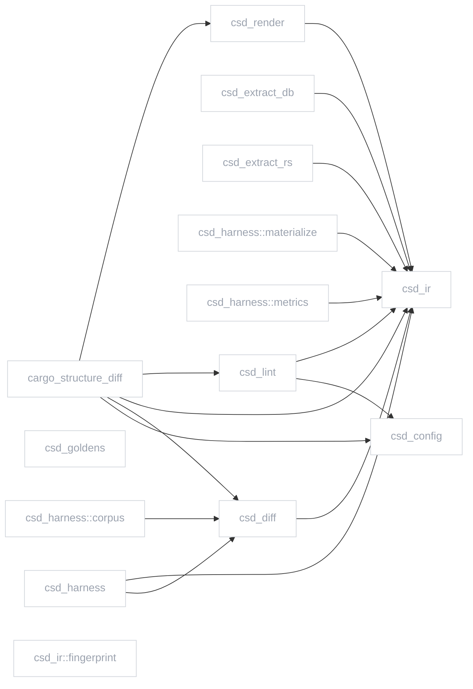

# Structure report

Generated by cargo-structure-diff (`csd doc`): a snapshot of the current working tree.

## Module index

- `cargo_structure_diff`
- `csd_config`
- `csd_diff`
- `csd_extract_db`
- `csd_extract_rs`
- `csd_goldens`
- `csd_harness`
- `csd_harness::corpus`
- `csd_harness::materialize`
- `csd_harness::metrics`
- `csd_ir`
- `csd_ir::fingerprint`
- `csd_lint`
- `csd_render`

## modules view



## states view

```mermaid
stateDiagram-v2
    classDef added fill:#f0fdf4,stroke:#22c55e,stroke-width:2px
    classDef removed fill:#fef2f2,stroke:#ef4444,stroke-width:2px,stroke-dasharray:4 4
    classDef changed fill:#fffbeb,stroke:#f59e0b,stroke-width:2px
    classDef context fill:#ffffff,stroke:#d1d5db,color:#9ca3af
    %% no state machines (no enum has transitions)

```

